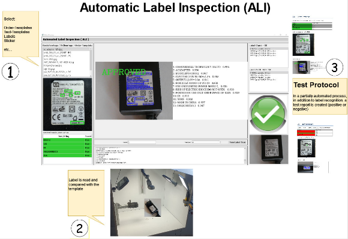

**ALI – Automated Label Inspection**

Update: 26.06.24

@all\_user\_\* **ens**:inne\*nen\*ens:nen..ens

D:\ALL\_PROJECT\a\_Factory\ALI\py39pa

**What is ALI?**

ALI stands for “ automated label inspection ”. ALI was designed for use in small series production (low to medium quantities). ALI supports the inspection and quality control of printed labels.

Checking labels for complete correctness is certainly not one of the most exciting activities in the working world. In addition, such inspection tasks are time-consuming and tiring for people. This is how the USECASE from ALI (automated label inspection) came about. Designed for "pre-series tasks for small to medium quantities", ALI is intended to help with this type of quality assurance. 
Available on Github: <https://github.com/iCounterBOX/ALI---automated-Label-Inspection>

**Order templates / reference templates?**

In order for ALI to be able to "check", reference templates are needed (e.g. order templates, samples, etc. ) . These are "taught" in ALI in a similar way to the learning process for object detection. We use a so-called label image tool here (e.g. https://www.makesense.ai/ [) ](https://www.makesense.ai/).

This means that different reference templates can be stored in ALI. An ALI test then compares the stored reference document with the object that is compared to it during the test via webcam (USB cam) .

**OCR:**

Paddle-OCR:  ( [https://github.com/PaddlePaddle/PaddleOCR ](https://github.com/PaddlePaddle/PaddleOCR)).

See also [https://github.com/iCounterBOX/Paddle-OCR-on-Webcam ](https://github.com/iCounterBOX/Paddle-OCR-on-Webcam)...Here I describe in detail how PaddleOCR runs in the CUDA environment under WIN 10.

**Prerequisites :**

WIN10, CUDA 11.2 and cuDNN8​

available here as an .EXE . It comes with all Python dependencies and can be used immediately.

**YouTube:**

[**https://www.youtube.com/watch?v=cS_orV-vrYg**](https://www.youtube.com/watch?v=cS_orV-vrYg)

**Webcam :**

  e.g. Angetube 60FPS 1080P Webcam – quite good webcam . In principle no special requirements for the webcam !!

**Code / run finally as EXE-File** :

Originally, the plan was to make ALI available here as an EXE file. The ZIP with the exe is 4 GB - much too big for github. The good news: ALI can be easily made into an exe with auto-py-to-exe. The code is now available here in the repository. My devel environment is Anaconda + Spyder ( py39 )

  this json is for the auto-py-to-exe

**Special ALI folders:**

.. here are the images and labels “learned” via MakeSense

.. this is where the protocols are stored ( docx / word ). These can also be deleted or copied here, for example ...

**The crucial Parts:**

Local path:

D:/ALL\_PROJECT/a\_Boc/pyQT5\_experimental/ai/py39pa

  is calling the auto-py-to-exe

  MUST copy some stuff into OUTPUT/EXE folder

 option for future setup! None of those keys is currently used!

As ALI is most times using an external camera ( Cam 1 ? ) we set 1 as default:

  user can change the cam to any nr user need..

Short introduction to MakeSense / <https://www.makesense.ai/>

Teach in Images/labes

   click Get Started

Open folder with your annotation-Images ( References, Bestellvorlagen, Patterns etc,..)

DnD those into Makesense

` `

Click  Object Detection

… load Labels from File.. 

Select labels:

  …DnD to MakeSense 

Start Project:

Now we have MakeSense open and se our Images:

Learn HOW to use MakeSense: <https://www.youtube.com/watch?v=shLogkPDtBk>

Finally store your ANNOTATIONS in voc-Format

You may have a look to your generated VOC annotation files: 

Important ..however yo generate Image/annotation. Finally it MUST be located here:

 That’s it .. ALI is gently processing those files J
